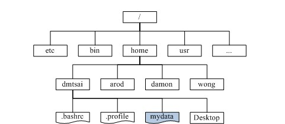
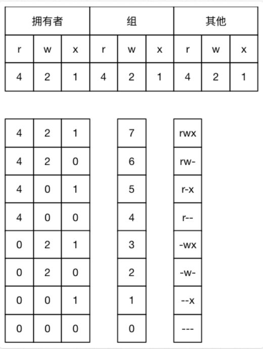
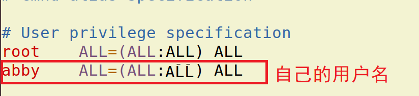
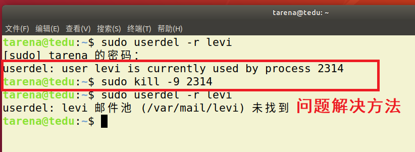

# Linux 操作系统

| Python 教学部 |
| ------------- |
| Author：吕泽  |

------

[TOC]

##  1. Linux操作系统认知

### 1.1 操作系统（Operation System简称OS）

* 定义

  操作系统是管理计算机硬件与软件资源的计算机程序，同时也是计算机系统的内核与基石。操作系统需要处理如管理与配置内存、决定系统资源供需的优先次序、控制输入设备与输出设备、操作网络与管理文件系统等基本事务。
  
  


* 操作系统功能

  > 1. 管理好硬件设备，为用户提供调用方法
  > 2. 是计算机中最重要的系统环境
  > 3. 管理各种其他的软件和程序的运行
  > 4. 对系统中文件进行管理

* 操作系统分类

  > 1. 桌面系统：Windows ，macOS为主，图形界面良好用户群体大。
  > 2. 服务器系统：Linux，Unix为主，安全，稳定，费用低占有量大。windows占有率很低。
  > 3. 嵌入式系统：Linux为主，主要用于小型只能设备，如只能 手机，机器人等。

### 1.2 Linux系统介绍

* Linux 诞生

  1991 年 **林纳斯（Linus）** 就读于赫尔辛基大学期间，对 Unix 产生浓厚兴趣，林纳斯 经常要用他的终端 仿真器（Terminal Emulator） 去访问大学主机上的新闻组和邮件，为了方便读写和下载文件，他自己编写了磁盘驱动程序和文件系统，这些在后来成为了 Linux 第一个内核的雏形，当时，他年仅 21 岁！林纳斯利用C做工具，编写了 Linux 内核，一开始 Linux 并不能兼容 Unix只适用于 386，后来经过全世界的网友的帮助，最终能够兼容多种硬件。

  

* Linux系统特点

  * Linux是一款免费的操作系统
  * 支持多种平台
  * 支持多用户
  * 具有非常强大的网络功能

* Linux 应用领域

  * Linux 服务器 : 目前是服务器系统中最广泛一种。

      

  * 桌面应用: 新版本的Linux系统特别在桌面应用方面进行了改进，达到相当的水平  

  * 嵌入式系统：由于Linux系统开放源代码，功能多样且具有极大的伸缩性，因此在嵌入式应用的领域有很广阔的应用市场。

* Linux系统构成

  * 内核: Linux操作系统的核心代码，是Linux系统的心脏，提供了系统的核心功能，用来与硬件交互。

    Linux内核官网 : [http://www.kernel.org](http://www.kernel.org)

  * 文件系统：通常指称管理磁盘数据的系统，可将数据以目录或文件的型式存储。每个文件系统都有自己的特殊格式与功能

  * 命令解释器：它使得用户能够与操作系统进行交互，负责接收用户命令，然后调用操作系统功能。

  * 应用软件：包含桌面系统和基础的软件操作工具等。

  

* Linux发型版本

  严格的来讲，Linux 只是一个系统内核，即计算机软件与硬件通讯之间的平台。一些组织或厂家将 Linux 内核与GNU软件（系统软件和工具）整合起来，并提供一些安装界面和系统设定与管理工具，这样就构成了一个发型套件，目前市面上较知名的发行版有：Ubuntu、RedHat、CentOS、Debian、Fedora、SuSE、OpenSUSE、Arch Linux、SolusOS 等。

### 1.3 文件系统

* 定义

  文件系统是计算机操作系统的重要的组成部分，用于组织和管理计算机存储设备上的大量文件。

* 文件系统结构

  * 熟悉的windows文件系统，分不同盘符

  

  * Linux的文件组织中没有盘符。将根（/）作为整个文件系统的唯一起点，其他所有目录都从该点出发。


​    

  犹如一颗倒置的树，所有存储设备作为这颗树的一个子目录。




* 普通文件和目录

  - 普通文件：包括文本，压缩包，音频视频等文件都是普通文件。
  - 目录：即文件夹，在Linux系统下多称之为目录。

  

  

* 主要目录功能

```reStructuredText
1. /bin目录

​  /bin目录包含了引导启动所需的命令或普通用户可能用的命令(可能在引导启动后)。这些命令都是二进制文件的可执行程序(bin是binary----二进制的简称)，多是系统中重要的系统文件。

2. /sbin目录

​  /sbin目录类似/bin，也用于存储二进制文件。因为其中的大部分文件多是系统管理员使用的基本的系统程序，所以虽然普通用户必要且允许时可以使用，但一般不给普通用户使用。

3. /etc目录

​  /etc目录存放着各种系统配置文件，其中包括了用户信息文件/etc/ passwd，系统初始化文件/etc/rc等。linux正是因为这些文件才得以正常地运行。

4. /root目录

​  /root 目录是超级用户的目录。

5. /lib目录

​  /lib目录是根文件系统上的程序所需的共享库，存放了根文件系统程序运行所需的共享文件。这些文件包含了可被许多程序共享的代码，以避免每个程序都包含有相同的子程序的副本，故可以使得可执行文件变得更小，节省空间。

6. /dev目录

​  /dev目录存放了设备文件，即设备驱动程序，用户通过这些文件访问外部设备。比如，用户可以通过访问/dev/mouse来访问鼠标的输入，就像访问其他文件一样。

7. /usr文件系统

​  /usr 是个很重要的目录，通常这一文件系统很大，因为所有程序安装在这里。本地安装的程序和其他东西在/usr/local 下，因为这样可以在升级新版系统或新发行版时无须重新安装全部程序。

8. /var文件系统

​  /var 包含系统一般运行时要改变的数据。通常这些数据所在的目录的大小是要经常变化或扩充的。

9. /home

​  /home 普通用户的默认目录，在该目录下，每个用户拥有一个以用户名命名的文件夹。

```


* 绝对路径和相对路径表达
  * 绝对路径：指文件在文件系统中以根目录为起始点的准确位置描述。例如“/usr/bin/gnect”就是绝对路径。最要的标志就是以 ‘/’ 作为路径描述的开头。
  * 相对路径：指相对于用户当前位置为起始点，对一个文件位置的逐层描述。例如，用户处在usr目录中时，只需要“games/gnect”就可确定这个文件。在相对路径描述时  .  表示当前目录,   ..  表示上一级目录。

### 1.4 Ubuntu使用 

作为Linux发行版中的后起之秀，Ubuntu Linux在短短几年时间里便迅速成长为从Linux初学者到资深专家都十分青睐的发行版。由于Ubuntu Linux是开放源代码的自由软件，用户可以登录Ubuntu Linux的官方网址免费下载该软件的安装包。

Ubuntu官网：[https://ubuntu.com/](https://ubuntu.com/)


## 2. Linux常用命令

* 学习目的
  1. Linux下有非常丰富的命令，可以用来完成大部分重要的Linux服务器操作维护功能，而且至今有些功能仍然通过命令操作比较方便。
  2. 实际工作中，大量服务器维护工作都是工程师通过远程控制来完成的，并没有图形界面，这时维护工作都需要通过命令来完成。
  3. 作为后端工程师，我们将来所写的代码都需要在服务器上运行，掌握基本的Linux 操作命令有助于我们将来对项目的部署和控制工作。


### 2.1 终端与命令行

* 终端 ： 使用命令对Linux系统进行操作的窗口
* 命令行：书写Linux命令的提示行


* 打开关闭终端方法
  * 点击图形界面终端图标，通过ctrl+alt +t  ,shift+ctrl + t  , shift+ctrl+n 都可以快速打开一个终端。
  * 通过图形界面关闭，或者在命令行输入exit。
* 终端字体大小控制
  * 放大 摁住  ctrl 和 + 号 （不要忘了+号要使用shift）
  * 缩小 摁住  ctrl 和 -  号 


### 2.2 Linux常用命令

* 命令格式 

  ```shell
  command [-options] [parameter]
  
  说明：
  command：命令名称，一般为英文单词或单词的缩写
  [-options]：命令选项，辅助命令进行功能细化，也可以省略
  parameter：传给命令的参数，可以是0个或多个
  ```


#### 2.2.1 帮助命令

```bash
command --help
```

说明：

> 显示 `command` 命令的帮助信息


```bash
man command
```

说明：

- 查阅 `command` 命令的使用手册,摁q退出


#### 2.2.2 基础操作命令

| 序号  | 命令             | 作用                     |
| :--- | :-------------  | :----------------------- |
| 01   | ls              | 查看当前文件夹下的内容   |
| 02   | pwd             | 查看当前所在文件夹       |
| 03   | cd [目录名]      | 切换文件夹               |
| 04   | touch [文件名]   | 如果文件不存在，新建文件 |
| 05   | mkdir [目录名]   | 创建目录                 |
| 06   | rm [文件名]      | 删除指定的文件名         |
| 07   | cp             | 复制一个文件             |
| 08 | mv | 移动一个文件 |
| 09 | clear | 清屏 |

* 部分命令细节说明
  * ls ：  -l 展示详细信息，-a展示隐藏文件（Linux下 . 开头的为隐藏文件）。
  * cd： 参数为绝对路径或者相对路径，直接cd表示回到主目录。
  * touch:  可以同时跟多个参数表示创建多个文件。
  * mkdir: -p选项可以创建层目录
  * cp：如果拷贝的是一个目录需要使用 -r ，同时这个命令有另存为的作用
  * mv:  即使移动目录页不需要选项，有重命名的作用。
  * rm：删除表示直接删除，无法找回，如果删除目录需要加 -r选项
  * clear：等同于ctrl-l，清空屏幕。


> 小技巧： 使用Tab键可以自动补全文件名，目录名等信息


* 通配符

  * 作用：对一类文件名称的书写进行简化，例如file1.txt、file2.txt、file3.txt……，用户不必一一输入文件名，可以使用通配符完成。

    

  | 通配符             | 含义                         | 实例                                                         |
  | ------------------ | ---------------------------- | ------------------------------------------------------------ |
  | **星号（\*）**     | 匹配任意长度的字符串         | 用file_\*.txt，匹配file_wang.txt、file_Lee.txt、file_Liu.txt |
  | 问号（?）          | 匹配一个长度的字符           | 用flie_?.txt，匹配file_1.txt、file_2.txt、file_3.txt        |
  | **方括号（**[…]）  | 匹配其中指定的一个字符       | 用file_[otr].txt，匹配file_o.txt、file_r.txt和file_t.txt     |
  | 方括号（[   - ]）  | 匹配指定的一个字符范围       | 用file_[a-z].txt，匹配file_a.txt、file_b.txt，直到file_z.txt |


#### 2.2.3 文件操作

| 序号 | 命令                  | 作用                                                 |
| :--- | :-------------------  | :--------------------------------------------------- |
| 01   | cat 文件名          | 查看文件内容、创建文件、文件合并、追加文件内容等功能 |
| 02   | head 文件名         | 显示文件头部                                     |
| 03   | tail 文件名         | 显示文件尾部   |
| 04   | grep 搜索文本 文件名  | 搜索文本文件内容  |
| 05   | find  路径 -name 文件名  | 查找文件  |
| 06 | wc  文件名              | 查看文件行数，单词数等信息                           |

* 部分命令细节说明
  * head，tail ： 选项-n，n表示一个数字，即可指定查看前n行或者后n行，不加选项默认查看10行。
  * grep ： -n 用于显示行号，-i忽略大小写
  * wc : -c 表示查看多少字符，-l查看多少行，-w 查看多少单词。如果不加选项则显示这三项。
  * find：会从指定目录及其所有子目录中查询搜索文件。

​		

#### 2.2.4 压缩解压

| 序号 | 命令                  | 作用                                                 |
| :--- | :-------------------  | :--------------------------------------------------- |
| 01   | zip ，unzip | 将文件压缩为zip格式/将zip格式文件解压 |
| 02   | gzip，gunzip  | 将文件压缩为gz格式/将gz格式文件解压             |
| 03   | bzip2,bunzip2 | 将文件压缩为bz2格式/将bz2格式文件解压 |
| 04   | tar | 对gz或者bz2格式进行压缩解压 |

* 部分命令细节说明
  * zip： 用于常与windows交互的情况，-r选项可以压缩目录
  
    * > zip    test.zip   filelist 
  
    * > unzip  test.zip
  
  * gzip，bzip2：不常用，因为压缩或者解压后源文件就不再了，而且只能对一个文件操作
  
  * tar：-cjf 用于压缩bz2格式文件，-czf用于压缩gz格式文件，-xvf用于解压文件,兼容了gzip和bzip2命令的功能。
  
    * > tar -czf   file.tar.gz   file1  file2 
  
    * > tar -xvf file.tar.gz

​		

#### 2.2.5 权限管理

| 序号 | 命令                  | 作用                                                 |
| :--- | :-------------------  | :--------------------------------------------------- |
| 01   | sudo | 放在一个命令前，表示使用管理员权限执行 |
| 02   | chmod  | 修改文件权限         |


* 部分命令细节说明
  * sudo： 在打开终端第一次使用sudo时需要输入密码
  
  * `chmod` 在设置权限时，可以字母也可以使用三个数字分别对应 **拥有者** ／ **组** 和 **其他** 用户的权限
  
  ```bash
  直接修改文件|目录的 读|写|执行 权限，但是不能精确到 拥有者|组|其他
  chmod  augo+/-rwx 文件名/目录名
  ```
  
  
  
  > 例如：
  >`777` ===> `u=rwx,g=rwx,o=rwx`
  >`755` ===> `u=rwx,g=rx,o=rx`
  >`644` ===> `u=rw,g=r,o=r`


#### 2.2.6 显示展示命令
| 序号 | 命令                  | 作用                                                 |
| :--- | :-------------------  | :--------------------------------------------------- |
| 01   | echo | 向终端打印内容 |
| 02   | date | 显示当前时间 |
| 03   | df | 显示磁盘剩余空间 |
| 04   | whoami | 显示当前用户 |
| 05   | which | 显示执行命令所在位置 |

* 部分命令细节说明
  * echo ： -n表示打印完成不换行
  
  * df:  -h选项以M为单位显示，-T显示文件系统类型 ext4的为磁盘
  
  * which：命令也是一个程序，实际就是显示程序所在位置
  
* 输出重定向

  | 重定向符  | 含义                               | 实例                                                         |
  | --------- | ---------------------------------- | ------------------------------------------------------------ |
  | >   file  | 将file文件重定向为输出源，新建模式 | echo "hello world"   > out.txt，将执行结果，写到out.txt文件中，若有同名文件将被删除 |
  | >>   file | 将file文件重定向为输出源，追加模式 | ls   /usr   >> Lsoutput.txt，将ls   /usr的执行结果，追加到Lsoutput.txt文件已有内容后 |

* 管道

管道可以把一系列命令连接起来，意味着第一个命令的输出将作为第二个命令的输入，通过管道传递给第二个命令，第二个命令的输出又将作为第三个命令的输入，以此类推。

```shell
	ls | grep 'test'
```


​	

#### 	2.2.7 其他命令

| 序号 | 命令                  | 作用                                                 |
| :--- | :-------------------  | :--------------------------------------------------- |
| 01   | shutdown | 关机或者重启 |
| 02   | ln | 创建链接 |


* 部分命令细节说明
  * shutdown：
  
    * > shutdown -r now 立即重启
  
    * > shutdown now 立即关机
  
    * > shutdown +10 10分钟后关机
  
    * > shutdown -c  取消关机计划
  
  * ln : 一般使用  -s 选项 创建软链接，相当于快捷方式，如果跨目录创建要使用绝对路径。
  
    ```shell
    ln -s  hello.py  hello
    ```
  
    


## 3. Linux服务器环境

### 3.1 vi编译器

#### 3.1.1 什么是vi

vi是Linux操作系统中一个自带的编辑器。没有图形界面，只能编译文本内容，没有字体段落等设置，通过命令强大的命令完成一系列的编写工作。

#### 3.1.2 学习目的

1. 在实际工作中，要对 服务器上的文件进行 简单 的修改，使用 `vi` 进行快速的编辑即可。
2. 对一些配置文件的修改，需要一定的权限，这时vi编辑器是最佳选择。
3. vi 编辑器在 系统管理、服务器管理编辑文件时，其功能不是图形界面的编辑器能比拟的。

#### 3.1.3  操作使用

* 打开和新建文件

```bash
$ vi 文件名

如果文件已经存在，会直接打开该文件
如果文件不存在，会新建一个文件
```


* 工作模式

  1. **命令模式**
     - **打开文件首先进入命令模式**，是使用 `vi` 的 **入口**
     - 通过 **命令** 对文件进行常规的编辑操作，例如：**定位**、**翻页**、**复制**、**粘贴**、**删除**……
     - 在其他图形编辑器下，通过 **快捷键** 或者 **鼠标** 实现的操作，都在 **命令模式** 下实现
  2. **底行模式** —— 执行 **保存**、**退出** 等操作 
     - 要退出 `vi` 返回到控制台，需要在末行模式下输入命令
     - **末行模式** 是 `vi` 的 **出口**
  3. **编辑模式** —— 正常的编辑文字


* 进入编辑模式命令

| 命令 |  英文  | 功能                   |  常用  |
| :--: | :----: | ---------------------- | :----: |
|  i   | insert | 在当前字符前插入文本   |  常用  |
|  I   | insert | 在行首插入文本         | 较常用 |
|  a   | append | 在当前字符后添加文本   |        |
|  A   | append | 在行末添加文本         | 较常用 |
|  o   |        | 在当前行后面插入一空行 |  常用  |
|  O   |        | 在当前行前面插入一空行 |  常用  |


* 底行模式常用命令

| 命令 | 功能                           |
| :--: | ------------------------------ |
|  w   | 保存                           |
|  q   | 退出，如果没有保存，不允许退出 |
|  q! | 强行退出，不保存退出           |
|  wq  | 保存并退出                     |
| w! | 强制保存 |

* 命令模式常用命令

	* 1）行内移动
	| 命令 | 功能                           |
	| :--:  | ------------------------------ |
	|  w   | 向后移动一个单词               |
	|  b   | 向前移动一个单词               |
	|  0    | 行首                           |
	|  ^    | 行首，第一个不是空白字符的位置 |
|  $   | 行尾                           |
	
	* 2） 行数移动
	
	|  命令  | 功能                 |
	| :----:  | -------------------- |
	|   gg   | 文件顶部             |
	|   G    | 文件末尾             |
	| :数字 | 移动到 数字 对应行数 |


* 撤销和恢复撤销


|   命令   | 功能           |
| :------: | -------------- |
|    u     | 撤销上次命令   |
| CTRL + r| 恢复撤销的命令 |

* 删除文本

|    命令      | 功能                              |
| :---------: | --------------------------------- |
|      x       | 删除光标所在字符，或者选中文字    |
|     c      | 和移动命令连用,删除光标所在位置到指定位置内容 |

```
cw        # 从光标位置删除到单词末尾
c0        # 从光标位置删除到一行的起始位置
cb       # 从光标位置删除到单词开头
```

* 剪切、复制、粘贴

|    命令    | 功能                        |
| :---------:| --------------------------- |
|     yy     | 复制一行，可以 nyy 复制多行 |
|     dd     | 删除光标所在行，可以 ndd 复制多行 |
|      p     | 粘贴                        |


* 替换

| 命令 | 功能                   | 工作模式 |
| :--: | ---------------------- | -------- |
|  r  | 替换当前字符           | 命令模式 |
|  R   | 替换当前行光标后的字符 | 替换模式 |
|  :%s/str/replace/g   | 替换str为replace | 底行模式 |

> `R` 命令可以进入 **替换模式**，替换完成后，按下 `ESC` 可以回到 **命令模式**


* 查找

|  命令   | 功能     |
| :-----: | -------- |
|  /str   | 查找 str |
| :set nu | 显示行号 |

> 查找到指定内容之后，使用 `n` 查找下一个出现的位置


### 3.2 添加用户


#### 3.2.1 基本概念

* 用户：Linux操作系统可以有不同的用户，这是系统管理的重要一环，不同的用户有自己独立的空间内容。

* 用户组：为了方便对用户管理，Linux操作系统使用用户组的概念。将不同的用户添加到对应的组中，可以方便用户设置权限的设置。

* root用户：Linux系统中的root用户通常用于系统的维护和管理，对操作系统的所有资源具有所有访问权限，一般工作中不会使用root用户进行系统操作，防止一些误操作带来系统损坏。

  
  
#### 3.2.2  用户管理命令

|序号|	命令|	作用|
| :--: | ---------------------- | -------- |
|01| groupadd  组名 |	添加组|
|02|	groupdel 组名|	删除组|
|03| useradd -m 用户  -g  组 | 添加用户 |
|04|	passwd  用户名	|设置用户密码|
|05|	userdel -r 用户	|删除用户|


* useradd : -m 表示添加用户时添加主目录，-g表示选择用户所在组，如果不写默认会创建一个与用户同名的组。

  ```shell
  useradd -m levi
  ```

* passwd ： 设置密码，设置之后才能切换新用户登录

* 设置密码后为新用户添加sudo权限,打开sudoers文件增加如下内容，然后 :w! 强制保存 :q 退出

  ```
  sudo vi /etc/sudoers
  ```

  

  ```
  passwd levi
  注意：1. 新创建的用户和密码信息存储在 /etc/passwd文件中
       2. 如果切换用户终端命令行只有一个$ 提示，则vi打开这个文件，将该用户对应的内容修改
  ```

  

* userdel:  一般使用-r 彻底删除，如果删除失败说明刚刚使用了该用户没有注销，需要重启再删除。或者执行下面命令。

  


### 3.3 软件安装

Linux下安装的软件包是 deb格式软件包。由于当时Linux系统中软件包存在复杂的依赖关系。因而，通常使用网络安装。

| 作用                 | 命令                      |
| -------------------- | ------------------------- |
| 升级软件包           | apt   update          |
| 安装软件             | apt   install        |
| 卸载软件             | apt   remove  --purge |
| 删除缓存的软件安装包   | apt   clean          |


* 注意事项 ： 安装软件包通常需要使用管理员权限。
* 软件包下载位置：/var/cache/apt/archives

```
sudo apt install sl   # 安装
sudo apt remove --purge  sl  # 彻底卸载
```


### 3.4 ssh服务

ssh是一种安全协议，主要用于给远程登录会话数据进行加密，保证数据传输的安全。在数据传输方面有很多应用。之前说到，实际工作中经常需要远程访问服务器，ssh就是通用的远程访问服务器的方法。


* 安装启动

  - 安装ssh服务 ： sudo apt install openssh-server

  - 查看ssh服务状态 ： ps -e|grep ssh

    

  - 启动和关闭 ：
    
    > sudo service ssh start/restart/stop

* 常用命令


| 序号 | 命令          | 作用           |
| :--- | :----------- | :------------- |
| 01   | ssh 用户名@ip                   | 登录远程主机 |
| 02   | scp 用户名@ip:文件名或路径 用户名@ip:文件名或路径| 远程复制文件   |


1. ssh登录

   ```shell
   ssh  levi@192.168.100.5    # 登录
   exit                      # 退出
   ```

   


2. scp拷贝

   ```shell
   
   # 注意：`:` 后面的路径写绝对路径
   scp  demo.py levi@192.168.100.5:/home/tarena
   
   # 把远程主目录下demo.py文件 复制到本地当前目录下
   scp  levi@192.168.100.5:/home/tarena/demo.py  .
   
   # 加上 -r 选项可以传送文件夹
   scp -r demo levi@192.168.100.5:/home/tarena/
   
   ```


* ssh秘钥

  * 什么时候使用： 如果使用的客户端个人计算机是自己独有的计算机，经常通过ssh访问服务器，此时不想频繁输入密码，则可以使用秘钥处理。

    

  * 使用方法

    ```
    1. 在个人计算机中生产秘钥对 ： ssh-keygen  执行以后会在主目录下生成一个.ssh文件夹,其中包含私钥文件id_rsa和公钥文件id_rsa.pub。
    2. 在服务器主机上创建文件~/.ssh/authorized_keys，将信任的计算机的id_rsa.pub文件内容追加到服务器authorized_keys文件中，并修改其权限为777。
    ```

    

### 3.5 终端启动Python服务


在服务器中并没有pycharm这些集成编译工具，所有当我们最后将程序部署在服务器上执行时，往往需要通过终端运行python程序。

1. 编写python程序在第一行增加解释器声明


2. 修改文件的执行权限


3. 执行代码


   
