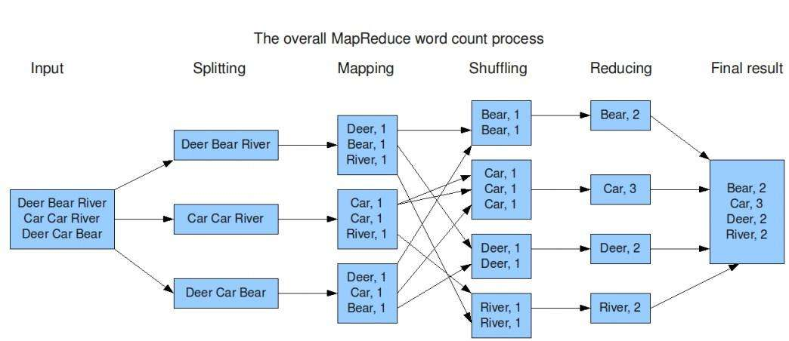

## **1. 大数据简介**

### **1.1 大数据的由来**

```
	随着计算机技术的发展，互联网的普及，信息的积累已经到了一个非常庞大的地步，信息的增长也在不断的加快，随着互联网、物联网建设的加快，信息更是爆炸式增长，收集、检索、统计这些信息越发困难，必须使用新的技术来解决这些问题
```

### **1.2 什么是大数据**

```
【1】定义
	大数据指无法在一定时间范围内用常规软件工具进行捕捉、管理和处理的数据集合，需要新处理模式才能具有更强的决策力、洞察发现力和流程优化能力的海量、高增长率和多样化的信息资产
	
【2】总结
	大数据是指即从各种各样类型的数据中，获得有价值的信息
```

### **1.3 大数据特性**

```
【1】大体量（Volume）
	数据体量大,一般从TB级别开始计算，可从数百TB到数十数百PB甚至EB的规模
	KB、MB、GB、TB、PB、EB、... ...
	1KB = 1024Bytes
	1MB = 1024K
	1GB = 1024M
	1TB = 1024G
	1PB = 1024T
	1EB = 1024P
	... ...
【2】多样性（Variety）
	数据的种类和来源多(多种异构数据源,数据库、爬虫、网络日志......)
【3】时效性（Velocity）
	很多大数据需要在一定的时间限度下得到及时处理
【4】准确性（Veracity）
	处理的结果要保证一定的准确性
【5】大价值（Value）
	大数据包含很多深度的价值，大数据分析挖掘和利用将带来巨大的商业价值

【补充】
	数据的价值密度越来越低,但是这并不意味着想要的数据越来越少,相反我们想要的数据是越来越多，但是样本总量的增长速度是要高于想要的数据的增长速度的
```

### **1.4 带来的问题**

```
【1】数据存储问题 - 存储速度、存储空间
【2】数据计算|分析问题 - 性能与效率问题
```

### **1.5 大数据与Hadoop**

```
【1】Hadoop是什么？
    1.1) Hadoop是一种分析和处理海量数据的软件平台
    1.2) Hadoop是一款开源软件，使用JAVA开发
    1.3) Hadoop可以提供一个分布式基础架构
```

## **2. Hadoop简介**

### **2.1 Hadoop概述**

#### **2.1.1 Hadoop概念**

- **定义**

  Hadoop是Yahoo!开发，后贡献给了Apache的一套开源的、可靠的、可扩展的用于分布式计算的框架

- **Hadoop作者** 

  Doug cutting

- **Hadoop名字由来** 

  以Hadoop作者的孩子的一个棕黄色的大象样子的玩具的命名

  


#### **2.1.2 Hadoop特点**

- **高可靠性** 

  Hadoop按位存储和数据处理的能力值得信赖

- **高扩展性**

  Hadoop通过可用的计算机集群分配数据，完成存储和计算任务，这些集群可以方便地扩展到数以千计的节点中，具有高扩展性

- **高效性**

  Hadoop能够在节点之间进行动态地移动数据，并保证各个节点的动态平衡，处理速度非常快，具有高效性

- **高容错性**

  Hadoop能够自动保存数据的多个副本（默认是3个），并且能够自动将失败的任务重新分配

#### **2.1.3 Hadoop能做什么**

- **大数据量存储**

  分布式存储（各种云盘，百度，360~还有云平台均有hadoop应用）

- **日志处理**

- **搜索引擎**

  如何存储持续增长的海量网页:  单节点 V.S. 分布式存储

  如何对持续增长的海量网页进行排序: 超算 V.S. 分布式计算

- **数据挖掘**

  目前比较流行的广告推荐

#### **2.1.4 Hadoop版本**

- **Hadoop1.0**

  包含Common，HDFS和MapReduce，停止更新

- **Hadoop2.0**

  包含了Common，HDFS，MapReduce和YARN。Hadoop2.0和Hadoop1.0完全不兼容。

- **Hadoop3.0**

  包含了Common，HDFS，MapReduce，YARN。Hadoop3.0和Hadoop2.0是兼容的

### **2.2 Hadoop核心组件**

#### **2.2.1 HDFS（Hadoop Distributed File System）**

- **HDFS**

  分布式存储，解决海量数据的存储

- **HDFS特点及原理**

  HDFS具有扩展性、容错性、海量数量存储的特点

  原理为将大文件切分成指定大小的数据块, 并在分布式的多台机器上保存多个副本

- **HDFS角色和概念**

  1. Client

     1.1 切分文件

     1.2 与namenode交互获取节点或文件元数据

     1.3 与datanode交互写入或读取数据

  2. Namenode（master节点）

     2.1 存入文件元数据信息

     2.2 配置副本策略

     2.3 处理客户端的所有请求(读和写)

  3. Secondarynode

     3.1 定期同步NameNode的元数据和日志信息，紧急情况下，可转正

  4. Datanode（slave）

     4.1 存储具体数据

     4.2 汇报存储信息给namenode

  5. Block

     每块默认128MB大小

     每块可以多个副本

- **HDFS示意图**

  

- **HDFS原理图**

  ==1、每个数据块3个副本，分布在两个机架内的节点，2个副本在同一个机架上，另外一个副本在另外的机架上==

  

  ==2、心跳检测，datanode定期向namenode发送心跳消息。查看是否有datanode挂掉了==

  ​								

  ==3、secondary namenode;定期同步元数据映像文件和修改日志，namenode发生故障，secondaryname会成为主namenode==

  ​					

  

- **==HDFS写文件流程==**

  ```
  【1】客户端将文件拆分成固定大小128M的块，并通知namenode
  【2】namenode找到可用的datanode返回给客户端
  【3】客户端根据返回的datanode，对块进行写入
  【4】通过流水线管道流水线复制
  【5】更新元数据，告诉namenode已经完成了创建新的数据块，保证namenode中的元数据都是最新的状态
  ```

  ​	

- **==HDFS读文件流程==**

  ```
  【1】客户端向namenode发起读请求，把文件名，路径告诉namenode
  【2】namenode查询元数据，并把数据返回客户端
  【3】此时客户端就明白文件包含哪些块，这些块在哪些datanode中可以找到
  ```

  ​	

#### **2.2.2 MapReduce**

- **MapReduce实现了分布式计算**

  Hadoop的MapReduce是对google三大论文的MapReduce的开源实现，实际上是一种编程模型，是一个分布式的计算框架，用于处理海量数据的运算，由JAVA实现

- **MapReduce原理图**

  

- **MapReduce角色及概念**

  1. JobTracker

     –Master节点只有一个

     –管理所有作业/任务的监控、错误处理等

     –将任务分解成一系列任务，并分派给TaskTracker

  2. TaskTracker

     –Slave节点，一般是多台

     –运行Map Task和Reduce Task

     –并与JobTracker交互，汇报任务状态

  3. Map Task

     –解析每条数据记录，传递给用户编写的map()并执行，将结果输出

  4. Reducer Task

     –从Map Task的执行结果中，远程读取输入数据，对数据进行排序，将数据按照分组传递给用户编写的reduce函数执行

#### 2.2.3 Yarn

- **作用**

  负责整个集群资源的管理和调度，是Hadoop的一个通用的资源管理系统

- **定义**

  Apache Hadoop YARN （Yet Another Resource Negotiator，另一种资源协调者）是一种新的 Hadoop 资源管理器，它是一个通用资源管理系统，可为上层应用提供统一的资源管理和调度，它的引入为集群在利用率、资源统一管理和数据共享等方面带来了巨大好处

- **原理图**

  

- **Yarn角色及概念**

  1. Resourcemanager

     –处理客户端请求 

     –启动/监控ApplicationMaster

     –监控NodeManager

     –资源分配与调度 

  2. Nodemanager

     –单个节点上的资源管理 

     –处理来自ResourceManager的命令 

     –处理来自ApplicationMaster的命令 

  3. ApplicationMaster

     –为应用程序申请资源，并分配给内部任务 

     –任务监控与容错 

  4. Container

     –对任务运⾏行环境的抽象，封装了CPU 、内存等

  5. Client

     –用户与Yarn交互的客户端程序 

     –提交应用程序、监控应用程序状态，杀死应用程序等 

### **2.3 Hadoop总结**

#### **2.3.1 Hadoop组成**

1. 分布式存储 - HDFS
2. 分布式计算 - MapReduce+Yarn

#### **2.3.2 HDFS特点**

- **HDFS优点**
  1. 高可靠性
  2. 高扩展性
  3. 高效性
  4. 高容错性
  5. 低成本 ：与一体机、商用数据仓库等相比，hadoop是开源的，项目的软件成本因此会大大降低
- **HDFS缺点**
  1. 不能做到低延迟，对于低延迟数据访问，不适合hadoop
  2. 不适合大量小文件存储，由于namenode将文件系统的元数据存储在内存中，因此该文件系统所能存储的文件总数受限于namenode的内存容量，根据经验，每个文件、目录和数据块的存储信息大约占150字节
  3. 对于上传到HDFS上的文件，不支持修改文件，HDFS适合一次写入，多次读取的场景

#### **2.3.3 HDFS相关**

- **名词**
  1. NameNode
  2. DataNode
- **写入文件流程**
  1. 客户端将文件拆分成固定大小128M的块，并通知namenode
  2. namenode找到可用的datanode返回给客户端
  3. 客户端根据返回的datanode，对块进行写入
  4. 通过流水线管道流水线复制
  5. 更新元数据，告诉namenode已经完成了创建新的数据块，保证namenode中的元数据都是最新的状态
- **读取文件流程**
  1. 客户端向namenode发起独立请求，把文件名，路径告诉namenode
  2. namenode查询元数据，并把数据返回客户端
  3. 此时客户端就明白文件包含哪些块，这些块在哪些datanode中可以找到

## **3. 环境安装**

### **3.1 安装方式**

- **单机模式**

  只能启动MapReduce

- **伪分布式**

  能启动HDFS、MapReduce 和 YARN的大部分功能

- **完全分布式**

  能启动Hadoop的所有功能

### **3.2 安装JDK**

#### **3.2.1 JDK安装步骤**

1. 下载JDK安装包（下载Linux系统的 .tar.gz 的安装包）

   https://www.oracle.com/java/technologies/javase/javase-jdk8-downloads.html

2. 更新Ubuntu源

   sudo apt-get update

3. 将JDK压缩包解压到Ubuntu系统中 /usr/local/ 中

   sudo tar -zxvf jdk-8u251-linux-x64.tar.gz -C /usr/local/

4. 将解压的文件夹重命名为 jdk8

   cd /usr/local/

   sudo mv jdk1.8.0_251/ jdk8

5. 添加到环境变量

   cd /home/tarena/

   sudo gedit .bashrc

   在文件末尾添加如下内容:

   ```
   export JAVA_HOME=/usr/local/jdk8
   export JRE_HOME=$JAVA_HOME/jre
   export CLASSPATH=.:$JAVA_HOME/lib:$JRE_HOME/lib
   export PATH=.:$JAVA_HOME/bin:$PATH
   ```

   source .bashrc

6. 验证是否安装成功

   java -version

   <出现java的版本则证明安装并添加到环境变量成功 java version "1.8.0_251">

### **3.3 安装Hadoop并配置伪分布式**

#### **3.3.1 Hadoop安装配置步骤**

1. 安装SSH

   sudo apt-get install ssh

2. 配置免登录认证,避免使用Hadoop时的权限问题

   ssh-keygen -t rsa   （输入此条命令后一路回车）

   cd ~/.ssh

   cat id_rsa.pub >> authorized_keys

   ssh localhost   （发现并未让输入密码即可连接）

   exit   （退出远程连接状态）

3. 下载Hadoop 2.10（374M）

   https://archive.apache.org/dist/hadoop/common/hadoop-2.10.0/hadoop-2.10.0.tar.gz

4. 解压到 /usr/local 目录中,并将文件夹重命名为 hadoop，最后设置权限

   sudo tar -zxvf hadoop-2.10.0.tar.gz -C /usr/local/

   cd /usr/local

   sudo mv hadoop-2.10.0/ hadoop2.10

   sudo chown -R tarena hadoop2.10/

5. 验证Hadoop

   cd /usr/local/hadoop2.10/bin

   ./hadoop version   （此处出现hadoop的版本）

6. 设置JAVE_HOME环境变量

   sudo gedit /usr/local/hadoop2.10/etc/hadoop/hadoop-env.sh

   把原来的export JAVA_HOME=${JAVA_HOME}改为
   export JAVA_HOME=/usr/local/jdk8

7. 设置Hadoop环境变量

   sudo gedit /home/tarena/.bashrc

   在末尾追加

   ```
   export HADOOP_HOME=/usr/local/hadoop2.10
   export CLASSPATH=.:{JAVA_HOME}/lib:${HADOOP_HOME}/sbin:$PATH
   export PATH=.:${HADOOP_HOME}/bin:${HADOOP_HOME}/sbin:$PATH
   
   ```

   source /home/tarena/.bashrc

8. 伪分布式配置，修改2个配置文件（core-site.xml 和 hdfs-site.xml）

9. 修改core-site.xml

   sudo gedit  /usr/local/hadoop2.10/etc/hadoop/core-site.xml

   添加如下内容

   ```html
   <configuration>
       <property>
           <!--数据目录配置参数-->
           <name>hadoop.tmp.dir</name>
           <value>file:/usr/local/hadoop2.10/tmp</value>
       </property>
       <property>
           <!--文件系统配置参数-->
           <name>fs.defaultFS</name>
           <value>hdfs://localhost:9000</value>
       </property>
   </configuration>
   
   ```

10. 修改hdfs-site.xml

    sudo gedit /usr/local/hadoop2.10/etc/hadoop/hdfs-site.xml

    添加如下内容

    ```html
    <configuration>
        <property>
            <!--副本数量-->
            <name>dfs.replication</name>
            <value>1</value>
        </property>
        <property>
            <!--namenode数据目录-->
            <name>dfs.namenode.name.dir</name>
            <value>file:/usr/local/hadoop2.10/tmp/dfs/name</value>
        </property>
        <property>
            <!--datanode数据目录-->
            <name>dfs.datanode.data.dir</name>
            <value>file:/usr/local/hadoop2.10/tmp/dfs/data</value>
        </property>
    </configuration>
    
    ```

11. 配置YARN - 1

    cd /usr/local/hadoop2.10/etc/hadoop

    cp mapred-site.xml.template mapred-site.xml

    sudo gedit mapred-site.xml

    添加如下配置

    ```html
    <property>
        <name>mapreduce.framework.name</name>
        <value>yarn</value>
    </property>
    
    ```

12. 配置YARN - 2

    sudo gedit yarn-site.xml

    添加如下配置：

    ```html
    <property>
        <name>yarn.nodemanager.aux-services</name>
        <value>mapreduce_shuffle</value>
    </property>
    
    ```

13. 执行NameNode格式化

    cd /usr/local/hadoop2.10/bin

    ./hdfs namenode -format

    出现 Storage directory /usr/local/hadoop2.10/tmp/dfs/name has been successfully formatted 则表示格式化成功

14. 启动Hadoop所有组件

    cd /usr/local/hadoop2.10/sbin

    ./start-all.sh

    启动时可能会出现警告，直接忽略即可，不影响正常使用

15. 启动成功后，可访问Web页面查看 NameNode 和 Datanode 信息，还可以在线查看 HDFS 中的文件

     http://localhost:50070

16. 查看Hadoop相关组件进程

    jps

    会发现如下进程

    ```
    NameNode
    DataNode
    SecondaryNameNode
    ResourceManager
    NodeManager
    
    ```

17. 测试 - 将本地文件上传至hdfs

    hadoop fs -put 一个本地的任意文件 /

    hadoop fs -ls /

    也可以在浏览器中Utilities->Browse the file system查看

## **4. HDFS Shell操作**

### **4.1 命令格式**

hadoop fs -命令

### **4.2 常用命令汇总**

- **查看HDFS系统目录（ls）**

  命令格式 ：hadoop fs -ls 路径

  示例 ：hadoop fs -ls /

- **创建文件夹（mkdir）**

  命令格式1 ：hadoop fs -mkdir 绝对路径

  命令格式2 ：hadoop fs -mkdir -p 绝对路径   （可递归创建文件夹）

  示例1 ：hadoop fs -mkdir /test

  示例2 ：hadoop fs -mkdir -p /test/stu

- **上传文件（put）**

  命令格式 ：hadoop fs -put    本地文件     HDFS目录

  示例 ：hadoop fs -put words.txt /test/

- **下载文件（get）**

  命令格式 ：hadoop fs  -get   HDFS文件    本地目录

  示例 ：hadoop fs -get   /test/words.txt     /home/tarena/

- **删除文件或目录（rm）**

  命令格式1 ：hadoop fs -rm 文件或目录的绝对路径

  命令格式2 ：hadoop fs -rm -r 目录  （删除文件夹要加 -r 选项）

  示例1 ：hadoop fs -rm /test/words.txt

  示例2 ：hadoop fs -rm -r /test

- **查看文件内容（text）**

  命令格式 ：haddop fs -text 文件绝对路径

  示例 ：hadoop fs -text /test/words.txt

- **移动（mv）**

  命令格式 ：hadoop fs -mv 源文件 目标目录

  示例 ：hadoop fs -mv     /test/words.txt        /words.txt

- **复制（cp）**

  命令格式 ：hadoop fs -cp 源文件  目标目录

  示例 ：hadoop fs -cp    /test/words.txt      /words.txt

### **4.3 HDFS Shell操作练习**

1. 在本地 /home/tarena/ 下新建 students.txt

   touch   /home/tarena/students.txt

2. 在students.txt中任意添加内容

   Twink Twink little star

   How I wonder what you are

3. 在HDFS中创建 /studir/stuinfo/ 目录

   hadoop  fs  -mkdir  -p  /studir/stuinfo/

4. 将本地students.txt文件上传到HDFS中

   hadoop  fs  -put  /home/tarena/students.txt    /studir/stuinfo/

5. 查看HDFS中 /studir/stuinfo/students.txt 的内容

   hadoop  fs  -text  /studir/stuinfo/students.txt

6. 删除HDFS中的 /studir 目录

   hadoop  fs  -rm  -r  /studir

## **5. MapReduce详解**

### **5.1 MapReduce概述**

#### 5.1.1 MapReduce定义

1. MapReduce是Hadoop提供的一套进行分布式计算的框架，用于大规模数据集（大于1TB）的并行运算
2. MapReduce将计算过程拆分为2个阶段：Map(映射)阶段和Reduce(规约)阶段

#### 5.1.2 MapReduce编程模型

- **MapReduce分而治之思想**

  ```
  【示例1】
      需要在一堆扑克牌(张数未知)中统计四种花色的牌有多少张
      思路：
      	首先：需要找几个人（比如说四个人），每人给一堆，数出来四种花色的张数
      	然后：这四个人，每个人只负责统计一种花色，最终将结果汇报给一个人，此为典形的map-reduce模型
      
  【示例2】
      一堆钞票，请查找出各种面值的钞票分别有多少张？
      思路：
      	首先：每个人分一部分钞票，输出各种面值的分别有多少张
      	然后：汇总，每个人负责统计一种面值
  ```

- **统计文件中每个单词出现的次数原理图**

  

### **5.2 MapReduce编程实现**

#### **5.2.1 相关库安装**

sudo pip3 install mrjob

#### **5.2.2 Python实现wordcount案例**

1. 新建words.txt，并写入如下内容

   ```
   hello world
   hello tarena
   I am world and tarena
   I love tarena world
   ```

2. python代码实现wordcount

   ```python
   """
   1.mapper的执行次数由行数决定，
     参数1：行首的便宜量（一般用不到）
     参数2：一行的内容，经常写做 line
     
   2.reduce的执行次数由键的个数决定
     参数1（key）：由mapper() 发送
     参数2（value）：所有相同key的值的序列
   """
   
   from mrjob.job import MRJob
   
   class MRJobCounter(MRJob):
       def mapper(self, _, line):
           for w in line.split():
               yield w, 1
               
       def reducer(self, word, occurence):
           yield word, sum(occurence)
           
   if __name__ == '__main__':
       MRJobCounter.run()
   ```

3. 运行MapReduce程序的两种方式

   ```
   [1]本地模式（一次启动多个进程）
       python3 wordCount.py -r local word.txt > out2.txt
       
   [2]Hadoop模式
       python3 wordCount.py -r hadoop word.txt -o hdfs:///out
       
       验证
       	hadoop fs -ls /out
       	hadoop fs -text /out/part-00000
   ```

## **6. hive**

### **6.1 Hive概述**

#### **6.1.1 Hive概述**

1. Hive是基于Hadoop的一个**数据仓库工具**。可以将结构化的数据文件映射为一张表，并提供完整的sql查询功能，本质上还是一个文件
2. 底层是将sql语句转换为MapReduce任务进行运行
3. 本质上是一种**大数据离线分析**工具
4. 学习成本相当低，不用开发复杂的mapreduce应用，十分适合数据仓库的统计分析
5. hive可以用来进行 数据提取、转化、加载，这是一种可以存储、查询和分析存储在hadoop上的数据。

#### **6.1.2 数据仓库**

1. 数据是集成的，数据的来源可能是：MySQL、oracle、网络日志、爬虫数据...... 等多种异构数据源。Hadoop你就可以看成是一个数据仓库，分布式文件系统hdfs就可以存储多种不同的异构数据源

2. 数据仓库不仅要存数据，还要管理数据，即：hdfs 和 mapreduce，从这个角度看之前的hadoop其实就是一个数据仓库，hive其实就是在hadoop之外包了一个壳子，hive是基于hadoop的数据仓库工具，不通过代码操作，通过类sql语言操作数据仓库中的数据。

   底层其实仍然是分布式文件系统和mapreduce，会把sql命令转为底层的代码

3. 数据仓库的特征

   1. 数据仓库是多个异构数据源集成的
   2. 数据仓库存储的一般是历史数据，大多数的应用场景是读数据（分析数据）
   3. 数据库是为捕获数据而设计，而数据仓库是为了分析数据而设计
   4. 数据仓库是弱事务的，因为数据仓库存的是历史数据，一般都读（分析）数据场景

4. OLTP系统（online transaction processing）

   1. 数据库属于OLTP系统，联机事务处理，涵盖了企业大部分的日常操作，比如购物、库存、制造、银行、工资、注册、记账等，比如mysql oracle等关系型数据库
   2. OLTP系统的访问由于要保证原子性，所以有事务机制和恢复机制

5. OLAP系统（online analytical processing）

   1. 数据仓库属于OLAP系统，联机分析处理系统，hive等
   2. OLAP系统一般存储的是历史数据，所以大部分都是只读操作，不需要事务

#### **6.1.3 Hive的HQL**

1. HQL - Hive通过类SQL的语法，来进行分布式的计算
2. HQL用起来和SQL非常的类似，Hive在执行的过程中会将HQL转换为MapReduce去执行，所以Hive其实是基于Hadoop的一种分布式计算框架，底层仍然是MapReduce

#### **6.1.4 Hive特点**

- **Hive优点**
  1. 学习成本低，只要会sql就能用hive
  2. 开发效率高，不需要编程，只需要写sql
  3. 模型简单，易于理解
  4. 针对海量数据的高性能查询和分析
  5. 与 Hadoop 其他产品完全兼容
- **Hive缺点**
  1. 不支持行级别的增删改
  2. 不支持完整的在线事务处理

#### **6.1.5 Hive适用场景**

1. Hive 构建在基于静态（离线）批处理的Hadoop 之上，Hadoop通常都有较高的延迟并且在作业提交和调度的时候需要大量的开销。因此，Hive 并不能够在大规模数据集上实现低延迟快速的查询因此，Hive并不适合那些需要低延迟的应用
2. Hive并不提供实时的查询和基于行级的数据更新操作。Hive 的最佳使用场合是大数据集的离线批处理作业，例如，网络日志分析。

### **6.2 Hive安装**

#### **6.2.1 详细安装步骤**

1. 下载hive安装包（**2.3.7版本**）

   http://us.mirrors.quenda.co/apache/hive/

2. 解压到 /usr/local/ 目录下

   sudo tar -zxvf apache-hive-2.3.7-bin.tar.gz -C /usr/local

3. 给文件夹重命名

   sudo mv /usr/local/apache-hive-2.3.7-bin /usr/local/hive2.3.7

4. 设置环境变量

   sudo gedit /home/tarena/.bashrc
   在末尾添加如下内容

   ```
   export HIVE_HOME=/usr/local/hive2.3.7
   export PATH=.:${HIVE_HOME}/bin:$PATH
   ```

5. 刷新环境变量

   source /home/tarena/.bashrc

6. 下载并添加连接MySQL数据库的jar包（**8.0.19 Ubuntu Linux Ubuntu Linux 18.04**）

   下载链接: https://downloads.mysql.com/archives/c-j/
   解压后找到 mysql-connector-java-8.0.19.jar 
   将其拷贝到 /usr/local/hive2.3.7/lib
   sudo cp -p mysql-connector-java-8.0.19.jar /usr/local/hive2.3.7/lib/

7. 创建hive-site.xml配置文件

   sudo touch /usr/local/hive2.3.7/conf/hive-site.xml

   sudo gedit /usr/local/hive2.3.7/conf/hive-site.xml
   并添加如下内容

   ```html
   <configuration>
           <property>
               <name>javax.jdo.option.ConnectionURL</name>
               <value>jdbc:mysql://localhost:3306/hive?createDatabaseIfNotExist=true</value>
               <description>JDBC connect string for a JDBC metastore</description>
           </property>
           <property>
               <name>javax.jdo.option.ConnectionDriverName</name>
               <value>com.mysql.cj.jdbc.Driver</value>
               <description>Driver class name for a JDBC metastore</description>
           </property>
           <property>
               <name>javax.jdo.option.ConnectionUserName</name>
               <value>root</value>
               <description>username to use against metastore database</description>
           </property>
           <property>
               <name>javax.jdo.option.ConnectionPassword</name>
               <value>123456</value>
               <description>password to use against metastore database</description>
           </property>
   </configuration>
   ```

8. 在hive配置文件中添加hadoop路径

   cd /usr/local/hive2.3.7/conf
   sudo cp -p hive-env.sh.template hive-env.sh
   sudo gedit /usr/local/hive2.3.7/conf/hive-env.sh
   添加如下内容: 

   ```
   HADOOP_HOME=/usr/local/hadoop2.10
   export HIVE_CONF_DIR=/usr/local/hive2.3.7/conf
   ```

9. hive元数据初始化

   schematool -dbType mysql -initSchema

10. 测试hive

    hive

    hive>show databases;

    如果能够正常显示内容，则hive安装并配置完毕

#### **6.2.2 hive安装总结**

1. 安装JDK
2. 安装Hadoop
3. 配置JDK和Hadoop的环境变量
4. 下载Hive安装包
5. 解压安装hive
6. 下载并安装MySQL连接器
7. 启动Hadoop的HDFS和Yarn
8. 启动hive

### **6.3 Hive基本操作**

#### **6.3.1 文件和表如何映射**

1. 流程操作准备

   ```
   mkdir hivedata
   cd /home/tarena/hivedata/
   vi t1.txt
   
   1,tom,23
   2,lucy,25
   3,jim,33
   
   hadoop fs -mkdir /hivedata
   hadoop fs -put t1.txt /hivedata
   ```

2. 如何建立一张表和其对应

   ```
   【1】进入到hive的命令行进行建库建表操作
   	create database tedu;
   	use tedu;
   	create table t1(id int, name string, age int);
   
   【2】到hdfs中确认目录
   	/user/hive/warehouse/ 会有tedu.db
   
   【3】将本地t1.txt放到hdfs指定目录中
   	hadoop fs -put /home/tarena/hivedata/t1.txt /user/hive/warehouse/tedu.db/t1
   
   【4】在hive命令行进行查看测试
   	hive>select * from t1;
   	发现都是 NULL ，可能是分隔符的问题
   ```

3. 如何建立一张表和其对应 - 续1

   ```
   【1】创建表t2，并指定分隔符为 ,
   	create table t2(id int, name string, age int)row format delimited fields terminated by ',';
   
   【2】将t1.txt放到hdfs指定目录中
   	hadoop fs -put /home/tarena/hivedata/t1.txt /user/hive/warehouse/tedu.db/t2
   
   【3】查询验证
   	hive>select * from t2;
   	发现有具体数据了
   
   	hive>select count(id) from t2;
   ```

4. 练习

   ```
   【1】题目：把 /etc/passwd 映射为 stu库中的 t4表
   【2】答案
   	1、sudo cp /etc/passwd /home/tarena/
   	2、hive中建表
   		use stu;
   		create table t4(
   		username string,
   		password string,
   		uid int,
   		gid int,
   		comment string,
   		shell string
   		)row format delimited fields terminated by ':';
   	3、hadoop fs -put /home/tarena/passwd /user/hive/warehouse/stu.db/t4
   	4、select * from t4;
   ```

5. 补充(MySQL数据导入)

   ```
   【1】sudo cp /etc/passwd /var/lib/mysql-files
   【2】mysql -uroot -p123456
   【3】use stu;
   【4】建表
   create table t4(
   username varchar(50),
   password char(1),
   uid int,
   gid int,
   comment varchar(100),
   homedir varchar(100),
   shell varchar(100)
   );
   【5】执行数据导入
   load data infile '/var/lib/mysql-files/passwd'
   into table t4
   fileds terminated by ':'
   lines terminted by '\n';
   【6】查询确认
   select * from t4;
   ```

#### **6.3.2 hive基础指令**

| 命令                                                         | 作用                                                | 额外说明                                                     |
| :----------------------------------------------------------- | :-------------------------------------------------- | :----------------------------------------------------------- |
| show  databases;                                             | 查看都有哪些数据库                                  |                                                              |
| create database testdb;                                      | 创建testdb数据库                                    | 创建的数据库，实际是在Hadoop的HDFS文件系统里创建一个目录节点，统一存在： /user/hive/warehouse 目录下 |
| use  testdb;                                                 | 进入testdb数据库                                    |                                                              |
| show tables;                                                 | 查看当前数据库下所有表                              |                                                              |
| create table stutab    (id int,name string);                 | 创建stutab表，以及相关的两个字段                    | hive里，表示字符串用的是string，不用char和varchar     所创建的表，也是HDFS里的一个目录节点 |
| insert into stutab values(1,'zhang')；                       | 向stutab表插入数据                                  | HDFS不支持数据的修改和删除，因此已经插入的数据不能够再进行任何的改动     在Hadoop2.0版本后支持了数据追加。实际上，insert into 语句执行的是追加操作     hive支持查询，行级别的插入。不支持行级别的删除和修改     hive的操作实际是执行一个job任务，调用的是Hadoop的MR     插入完数据之后，发现HDFS stutab目录节点下多了一个文件，文件里存了插入的数据，因此，hive存储的数据，是通过HDFS的文件来存储的。 |
| select * from stutab                                         | 查看表数据                                          | 也可以根据字段来查询，比如select  id from stutab             |
| drop table stutab                                            | 删除表                                              |                                                              |
| select  * from stutab                                        | 查询stutab表数据                                    |                                                              |
| load data local inpath '/home/tarena/1.txt' into table stutab; | 通过加载文件数据到指定的表里                        | 在执行完这个指令之后，发现hdfs stu目录下多了一个1.txt文件。由此可见，hive的工作原理实际上就是在管理hdfs上的文件，把文件里数据抽象成二维表结构，然后提供hql语句供程序员查询文件数据     可以做这样的实验：不通过load 指令，而通过插件向stu目录下再上传一个文件，看下hive是否能将数据管理到stu表里。 |
| create table stu1(id int,name string) row format delimited fields   terminated by  '    '; | 创建stu1表，并指定分割符 空格。                     |                                                              |
| desc  stu                                                    | 查看 stu表结构                                      |                                                              |
| create table stu2 like stu                                   | 创建一张stu2表，表结构和stu表结构相同               | like只复制表结构，不复制数据                                 |
| insert  overwrite  table stu2    select * from stu           | 把stu表数据插入到stu2表中                           |                                                              |
| insert   overwrite local directory '/home/tarena/stu' row format delimited fields terminated by  '  ' select * from   stu; | 将stu表中查询的数据写到本地的/home/tarena/stu目录下 |                                                              |
| insert   overwrite directory '/stu' row format delimited fields terminated by  '    '  select   * from stu; | 将stu表中查询的数据写到HDFS的stu目录下              |                                                              |
| alter table  stu rename to   stu2                            | 为表stu重命名为stu2                                 |                                                              |
| alter table stu   add columns (age int);                     | 为表stu增加一个列字段age，类型为int                 |                                                              |
| exit                                                         | 退出hive                                            |                                                              |
|                                                              |                                                     |                                                              |

#### **6.3.3 内部表和外部表**

1. 默认为内部表，外部表的关键字 ：external

2. 内部表：对应的文件夹就在默认路径下 /user/hive/warehouse/库名.db/

3. 外部表：数据文件在哪里都行，无须移动数据

4. 示例

   ```mysql
   【1】创建外部表并查看（location指映射的文件路径）
   create external table studenttab(
   id int,
   name string,
   sex string, 
   age int
   )row format delimited fields terminated by ',' location '/stu';
   
   【2】上传文件并测试
   	hadoop fs -mkdir /stu
   	hadoop fs -put students.txt /stu
   	hive>select * from studenttab;
   	发现已经存在了数据，而且在默认路径下根本就没有文件夹
   
   【3】 删除表
   	2.1)删除内部表 drop table t2; 元数据和具体数据全部删除
   	2.2)删除外部表 drop table studenttab; 发现数据还在，只是删除了元数据
   	
   【4】内部表是受hive管理的表，外部表是不受hive管理的表
   
   【5】应用场景
   	对于一些原始日志文件，同时被多个部门同时操作的时候就需要使用外部表，如果不小心将meta data删除了，HDFS上的data还在可以恢复，增加了数据的安全性。
   	在对数据做统计分析时候用到的中间表，结果表可以使用内部表，因为这些数据不需要共享，使用内部表更为合适
   
   【6】实际工作中外部表使用较多，先在分布式文件系统中传文件，然后管理
   ```

5. 内部表和外部表区别总结

   ```
   【1】内部表无external关键字，外部表有
   【2】内部表由Hive自身管理，外部表由HDFS管理
   【3】内部表/user/hive/warehouse位置，外部表存在hdfs中任意位置
   【4】内部表元数据及存储数据一起删除，外部表会删除元数据，HDFS上不会被删除
   ```

- **Hive练习**

  在电商网站上，当我们进入到某电商页面浏览商品时，就会产生用户对商品访问情况的数据，包含两个字段(商品id，点击次数)，以逗号分隔，由于数据量很大，所以为了方便统计，我们只截取了一部分数据，内容如下：

  ```
  1010031,100
  1010102,100
  1010152,97
  1010178,96
  1010280,104
  1010320,103
  1010510,104
  1010603,96
  1010637,97
  ```

问题（hive中实现）:

问题1: 实现文件和表的映射

```
create table product_tab(
goods_id int,
goods_click int
)row format delimited fields terminated by ',';

load data local inpath '/home/tarena/hadoop/product.txt' into table product_tab;
```

问题2: 使用HQL命令实现对商品点击次数从低到高进行排序，即要求输出如下:

```
96 1010178
96 1010603
97 1010152
97 1010637
100 1010031
100 1010102
103 1010320
104 1010280
104 1010510

select goods_click,goods_id from product_tab order by goods_click;
```


