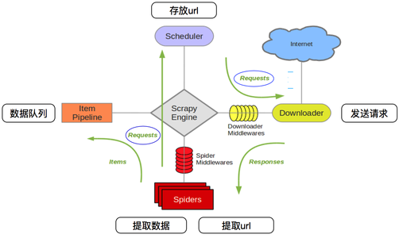

# **SPIDER-DAY06**

## **1. scrapy框架**

### **1.1 scrapy概述**

- **定义**

  ```python
  异步处理框架,可配置和可扩展程度非常高,Python中使用最广泛的爬虫框架
  ```

- **安装**

  ```python
  【1】Ubuntu安装
  	sudo pip3 install Scrapy
          
  【2】Windows安装
  	python -m pip install Scrapy
  
      如果安装过程中报如下错误 : 'Error: Microsoft Vistual C++ 14.0 is required xxx'
      则安装Windows下的Microsoft Vistual C++ 14.0 即可（笔记spiderfiles中有）
  ```

### **1.2 scrapy组件及流程**



- **Scrapy框架五大组件**

  ```python
  【1】引擎（Engine）----------整个框架核心
  【2】爬虫程序（Spider）------数据解析提取
  【3】调度器（Scheduler）-----维护请求队列
  【4】下载器（Downloader）----获取响应对象
  【5】管道文件（Pipeline）-----数据入库处理
  
  
  【两个中间件】
      下载器中间件（Downloader Middlewares）
          引擎->下载器,包装请求(随机代理等)
      蜘蛛中间件（Spider Middlewares）
          引擎->爬虫文件,可修改响应对象属性
  ```

- **scrapy爬虫工作流程**

  ```python
  【1】爬虫项目启动,由引擎向爬虫程序索要第一批要爬取的URL,交给调度器去入队列
  【2】调度器处理请求后出队列,通过下载器中间件交给下载器去下载
  【3】下载器得到响应对象后,通过蜘蛛中间件交给爬虫程序
  【4】爬虫程序进行数据提取：
      4.1) 数据交给管道文件去入库处理
      4.2) 对于需要继续跟进的URL,再次交给调度器入队列，依次循环
  ```

### **1.3scrapy命令**

```python
【1】创建爬虫项目 : scrapy startproject 项目名
【2】创建爬虫文件
    2.1) cd 项目文件夹
    2.2) scrapy genspider 爬虫名 域名
【3】运行爬虫
    scrapy crawl 爬虫名
```

### **1.4 scrapy目录结构**

- **scrapy项目目录结构**

  ```python
  Baidu                   # 项目文件夹
  ├── Baidu               # 项目目录
  │   ├── items.py        # 定义数据结构
  │   ├── middlewares.py  # 中间件
  │   ├── pipelines.py    # 数据处理
  │   ├── settings.py     # 全局配置
  │   └── spiders
  │       ├── baidu.py    # 爬虫文件
  └── scrapy.cfg          # 项目基本配置文件
  ```

- **settings.py常用变量**

  ```python
  【1】USER_AGENT = 'Mozilla/5.0'
  【2】ROBOTSTXT_OBEY = False
      是否遵循robots协议,一般我们一定要设置为False
  【3】CONCURRENT_REQUESTS = 32
      最大并发量,默认为16
  【4】DOWNLOAD_DELAY = 0.5
      下载延迟时间: 访问相邻页面的间隔时间,降低数据抓取的频率
  【5】COOKIES_ENABLED = False | True
      Cookie默认是禁用的，取消注释则 启用Cookie，即：True和False都是启用Cookie
  【6】DEFAULT_REQUEST_HEADERS = {}
      请求头,相当于requests.get(headers=headers)
  ```

### **1.5 scrapy爬虫步骤**

```python
【1】新建项目和爬虫文件
    scrapy startproject 项目名
    cd 项目文件夹
    新建爬虫文件 ：scrapy genspider 文件名 域名
【2】明确目标(items.py)
【3】写爬虫程序(文件名.py)
【4】管道文件(pipelines.py)
【5】全局配置(settings.py)
【6】运行爬虫
    6.1) 终端: scrapy crawl 爬虫名
    6.2) pycharm运行
        a> 创建run.py(和scrapy.cfg文件同目录)
	      from scrapy import cmdline
	      cmdline.execute('scrapy crawl maoyan'.split())
        b> 直接运行 run.py 即可
```

## **2. 瓜子二手车爬虫**

### **2.1 项目需求**

```python
【1】抓取瓜子二手车官网二手车数据（我要买车）
	官网URL地址: https://www.guazi.com/bj/buy/
            
【2】URL地址：https://www.guazi.com/bj/buy/o{}/#bread
    URL规律: o1  o2  o3  o4  o5  ... ...
        
【3】所抓数据
    3.1) 汽车链接
    3.2) 汽车名称
    3.3) 汽车价格
```

### **2.2 项目实现**

- **步骤1 - 创建项目和爬虫文件**

  ```python
  scrapy startproject Car
  cd Car
  scrapy genspider car www.guazi.com
  ```

- **步骤2 - 定义要爬取的数据结构**

  ```python
  """items.py"""
  import scrapy
  
  class CarItem(scrapy.Item):
      # 链接、名称、价格
      url = scrapy.Field()
      name = scrapy.Field()
      price = scrapy.Field()
  ```

- **步骤3 - 编写爬虫文件**

  ```python
  """
  xpath表达式如下:
  【1】基准xpath,匹配所有汽车节点对象列表
      li_list = response.xpath('//ul[@class="carlist clearfix js-top"]/li')
  
  【2】遍历后每辆车信息的xpath表达式
      汽车链接: './a[1]/@href'
      汽车名称: './/h2[@class="t"]/text()'
      汽车价格: './/div[@class="t-price"]/p/text()'
  """
  """
  	重写start_requests()方法，效率极高
  """
  # -*- coding: utf-8 -*-
  import scrapy
  from ..items import CarItem
  
  class GuaziSpider(scrapy.Spider):
      # 爬虫名
      name = 'car2'
      # 允许爬取的域名
      allowed_domains = ['www.guazi.com']
      # 1、去掉start_urls变量
      # 2、重写 start_requests() 方法
      def start_requests(self):
          """生成所有要抓取的URL地址,一次性交给调度器入队列"""
          for i in range(1,6):
              url = 'https://www.guazi.com/bj/buy/o{}/#bread'.format(i)
              # scrapy.Request(): 把请求交给调度器入队列
              yield scrapy.Request(url=url,callback=self.parse)
  
      def parse(self, response):
          # 基准xpath: 匹配所有汽车的节点对象列表
          li_list = response.xpath('//ul[@class="carlist clearfix js-top"]/li')
          # 给items.py中的 GuaziItem类 实例化
          item = CarItem()
          for li in li_list:
              item['url'] = li.xpath('./a[1]/@href').get()
              item['name'] = li.xpath('./a[1]/@title').get()
              item['price'] = li.xpath('.//div[@class="t-price"]/p/text()').get()
  
              # 把抓取的数据,传递给了管道文件 pipelines.py
              yield item
  ```
  
- **步骤4 - 管道文件处理数据**

  ```python
  """
  pipelines.py处理数据
  1、mysql数据库建库建表
  create database cardb charset utf8;
  use cardb;
  create table cartab(
  name varchar(200),
  price varchar(100),
  url varchar(500)
  )charset=utf8;
  """
  # -*- coding: utf-8 -*-
  
  # 管道1 - 从终端打印输出
  class CarPipeline(object):
      def process_item(self, item, spider):
          print(dict(item))
          return item
  
  # 管道2 - 存入MySQL数据库管道
  import pymysql
  
  class CarMysqlPipeline(object):
      def open_spider(self,spider):
          """爬虫项目启动时只执行1次,一般用于数据库连接"""
          self.db = pymysql.connect('localhost', 'root', '123456', 'cardb', charset='utf8')
          self.cursor = self.db.cursor()
  
      def process_item(self,item,spider):
          """处理从爬虫文件传过来的item数据"""
          ins = 'insert into cartab values(%s,%s,%s)'
          car_li = [item['name'],item['price'],item['url']]
          self.cursor.execute(ins,car_li)
          self.db.commit()
  
          return item
  
      def close_spider(self,spider):
          """爬虫程序结束时只执行1次,一般用于数据库断开"""
          self.cursor.close()
          self.db.close()
  
  
  # 管道3 - 存入MongoDB管道
  import pymongo
  
  class CarMongoPipeline(object):
      def open_spider(self,spider):
          self.conn = pymongo.MongoClient(MONGO_HOST,MONGO_PORT)
          self.db = self.conn[MONGO_DB]
          self.myset = self.db[MONGO_SET]
  
      def process_item(self,item,spider):
          car_dict = {
              'name' : item['name'],
              'price': item['price'],
              'url'  : item['url']
          }
          self.myset.insert_one(car_dict)
  ```
  
- **步骤5 - 全局配置文件（settings.py）**

  ```python
  【1】ROBOTSTXT_OBEY = False
  【2】DOWNLOAD_DELAY = 1
  【3】COOKIES_ENABLED = False
  【4】DEFAULT_REQUEST_HEADERS = {
      "Cookie": "此处填写抓包抓取到的Cookie",
      "User-Agent": "此处填写自己的User-Agent",
    }
  
  【5】ITEM_PIPELINES = {
       'Car.pipelines.CarPipeline': 300,
       'Car.pipelines.CarMysqlPipeline': 400,
       'Car.pipelines.CarMongoPipeline': 500,
    }
  ```
  
- **步骤6 - 运行爬虫（run.py）**

  ```python
  """run.py"""
  from scrapy import cmdline
  cmdline.execute('scrapy crawl car'.split())
  ```

## **3. scrapy知识点**

### **3.1 节点对象方法**

```python
【1】response.xpath('')
	结果: 列表,元素为选择器对象
     	 [ <selector xpath='xxx' data='A'>, <selector xpath='xxx' data='B'>]

【2】response.xpath('').extract()
	结果：['A','B']
    
【3】response.xpath().extract_first()
	response.xpath().get()
	结果: 'A'
```

### **3.2 数据持久化数据库**

```python
【1】pipelines.py定义管道类
	def open_spider(self,spider):
		"""爬虫开始执行1次,用于数据库连接"""
        
    def process_item(self,item,spider):
        """具体处理数据"""
        return item
    
	def close_spider(self,spider):
		"""爬虫结束时执行1次,用于断开数据库连接""" 

【2】settings.py中添加此管道
	ITEM_PIPELINES = {'':200}

【注意】 ：process_item() 函数中一定要 return item ,
	     当前管道的process_item()的返回值会作为下一个管道 process_item()的参数
```

### **3.3 数据持久化文件**

```python
【1】存入csv文件
    scrapy crawl car -o car.csv
 
【2】存入json文件
    scrapy crawl car -o car.json

【3】注意: settings.py中设置导出编码 - 主要针对json文件
    FEED_EXPORT_ENCODING = 'utf-8'
```

### **3.4 课堂练习**

```python
【熟悉整个流程】 : 将猫眼电影案例数据抓取，存入MySQL数据库
```

## **4. 多级页面scrapy爬虫**

### **4.1 项目需求**

- **目标说明**

  ```python
  【1】在抓取一级页面的代码基础上升级
  【2】一级页面所抓取数据（和之前一样）:
      2.1) 汽车链接
      2.2) 汽车名称
      2.3) 汽车价格
  【3】二级页面所抓取数据
      3.1) 行驶里程: //ul[@class="assort clearfix"]/li[2]/span/text()
      3.2) 排量:    //ul[@class="assort clearfix"]/li[3]/span/text()
      3.3) 变速箱:  //ul[@class="assort clearfix"]/li[4]/span/text()
  ```

### **4.2 在原有项目实现**

- **步骤1 - items.py**

  ```python
  # 添加二级页面所需抓取的数据结构
  
  import scrapy
  
  class GuaziItem(scrapy.Item):
      # define the fields for your item here like:
      # 一级页面: 链接、名称、价格
      url = scrapy.Field()
      name = scrapy.Field()
      price = scrapy.Field()
      # 二级页面: 时间、里程、排量、变速箱
      time = scrapy.Field()
      km = scrapy.Field()
      disp = scrapy.Field()
      trans = scrapy.Field()
  ```

- **步骤2 - car2.py**

  ```python
  """
  	重写start_requests()方法，效率极高
  """
  # -*- coding: utf-8 -*-
  import scrapy
  from ..items import CarItem
  
  class GuaziSpider(scrapy.Spider):
      # 爬虫名
      name = 'car2'
      # 允许爬取的域名
      allowed_domains = ['www.guazi.com']
      # 1、去掉start_urls变量
      # 2、重写 start_requests() 方法
      def start_requests(self):
          """生成所有要抓取的URL地址,一次性交给调度器入队列"""
          for i in range(1,6):
              url = 'https://www.guazi.com/bj/buy/o{}/#bread'.format(i)
              # scrapy.Request(): 把请求交给调度器入队列
              yield scrapy.Request(url=url,callback=self.parse)
  
      def parse(self, response):
          # 基准xpath: 匹配所有汽车的节点对象列表
          li_list = response.xpath('//ul[@class="carlist clearfix js-top"]/li')
          # 给items.py中的 GuaziItem类 实例化
          item = CarItem()
          for li in li_list:
              item['url'] = 'https://www.guazi.com' + li.xpath('./a[1]/@href').get()
              item['name'] = li.xpath('./a[1]/@title').get()
              item['price'] = li.xpath('.//div[@class="t-price"]/p/text()').get()
              # Request()中meta参数: 在不同解析函数之间传递数据,item数据会随着response一起返回
              yield scrapy.Request(url=item['url'], meta={'meta_1': item}, callback=self.detail_parse)
  
      def detail_parse(self, response):
          """汽车详情页的解析函数"""
          # 获取上个解析函数传递过来的 meta 数据
          item = response.meta['meta_1']
          item['km'] = response.xpath('//ul[@class="assort clearfix"]/li[2]/span/text()').get()
          item['disp'] = response.xpath('//ul[@class="assort clearfix"]/li[3]/span/text()').get()
          item['trans'] = response.xpath('//ul[@class="assort clearfix"]/li[4]/span/text()').get()
  
          # 1条数据最终提取全部完成,交给管道文件处理
          yield item
  ```

- **步骤3 - pipelines.py**

  ```python
  # 将数据存入mongodb数据库,此处我们就不对MySQL表字段进行操作了,如有兴趣可自行完善
  # MongoDB管道
  import pymongo
  
  class GuaziMongoPipeline(object):
      def open_spider(self,spider):
          """爬虫项目启动时只执行1次,用于连接MongoDB数据库"""
          self.conn = pymongo.MongoClient('localhost',27017)
          self.db = self.conn['guazidb']
          self.myset = self.db['guaziset']
  
      def process_item(self,item,spider):
          car_dict = dict(item)
          self.myset.insert_one(car_dict)
          return item
  ```


## **5. 今日作业**

```python
【1】把猫眼电影top100使用scrapy完成,并实现持久化
	URL地址：https://maoyan.com/board/4
【2】把豆瓣图书top250使用scrapy完成,并实现持久化
	URL地址：https://book.douban.com/top250?icn=index-book250-all
【3】把豆瓣电影(Ajax动态加载)使用scrapy完成,并实现持久化
	# 提示1：获取响应内容 response.text  (字符串类型)
	#        获取json数据  json.loads(response.text)
	# 提示2：scrapy的爬虫文件中，完全可以使用json模块、re模块、requests模块

【4】腾讯招聘职位信息抓取（二级页面）
	# 提示1：获取响应内容 response.text  (字符串类型)
	#        获取json数据  json.loads(response.text)
	# 提示2：scrapy的爬虫文件中，完全可以使用json模块、re模块、requests模块
	官网URL地址：https://careers.tencent.com/search.html
    要求：输入职位关键字，抓取该类别下所有职位信息（'到职位详情页抓取'）
    具体数据如下：
    1.1) 职位名称
    1.2) 职位地点
    1.3) 职位类别
    1.4) 发布时间
    1.5) 工作职责
    1.6) 工作要求
```

